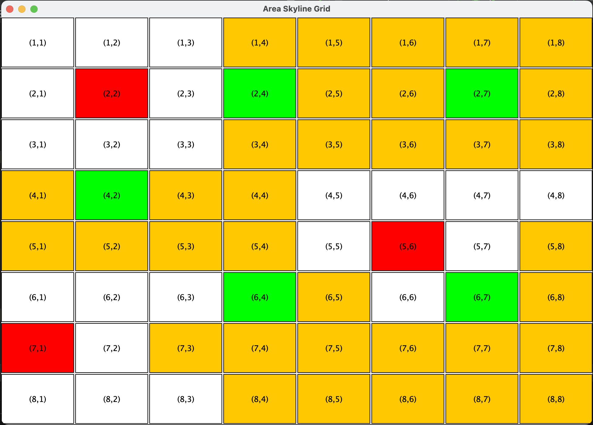

### Parallel implementation of Grid Area Skyline Algorithm (GASKY) 
+ Recommend the best location in a large grid denoting a spatial region, while each cell resembles some spatial location
on the map. 
+ We consider two main types of facilities (Favorable, Unfavourable) and different types of
facilities which are geographically distributed across different grid cells. 
+ Considering larger size grids,  euclidean distance across each pair is computationally heavy and unscalable, we implemented an efficient
approach using __Voronoi Polygons__ , and __Min Max distance__ algorithm.

All the implementation are done using Java, and require Java 8+ to run it.

### Parallel Programming is implemented using 

+ MPI (Message Passing Interface)
+ Spark
+ MapReduce 
+ MASS (Multi Agent Spatial Simulation).

### Parallel Algorithm Design Strategy 

+ Finding Concurrency: Task Parallelism → Each facility is computed independently, embracingly parallel).
+ Decomposition Pattern: Task Driven Data Decomposition → Each Facility Type determines the task that
internally decomposes the spatial grid covering respective facility coordinates.
+ Algorithmic Structure: Divide and Conquer → Divide Facility to compute Local Skyline, conquer them to
find global Skyline
+ Distributed Data Structure: Spatial Grid resembling a multi-dimensional spatial region.

I also created a Demo Rendering Widget to visualize a Spatial Grid.

